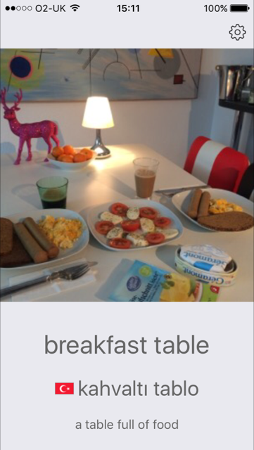
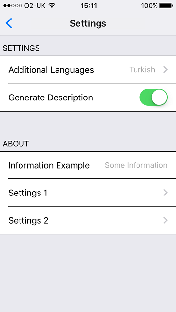
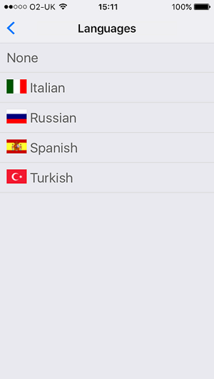
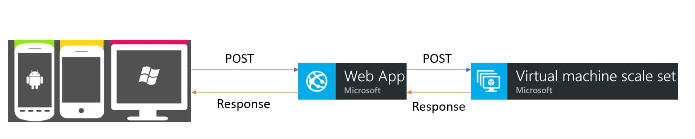
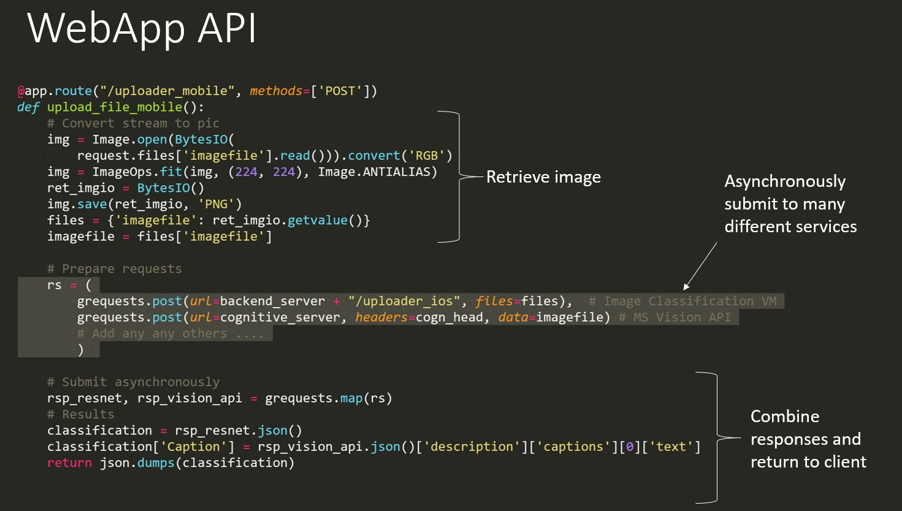
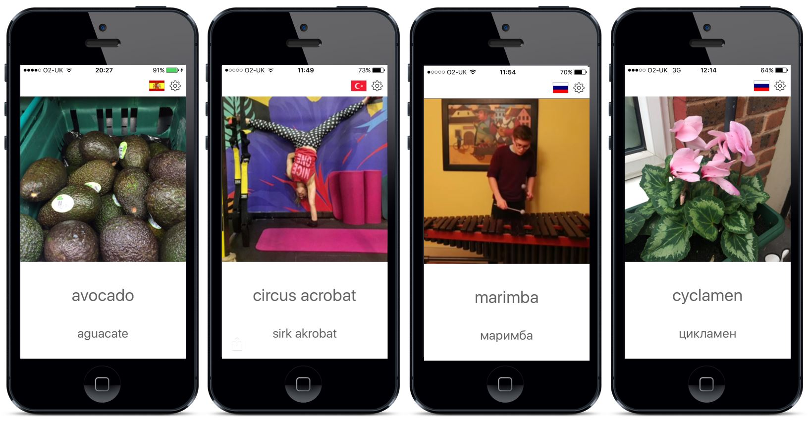

# Deep Learning (ResNet) on Mobile App

This project goes through an end-to-end example of using Azure services to:

1. Integrate your own deep-learning project with a mobile app
2. Integrate existing Azure APIs with a mobile app

### Web-View

### App-View

  

### Infrastructure

### Further Examples

