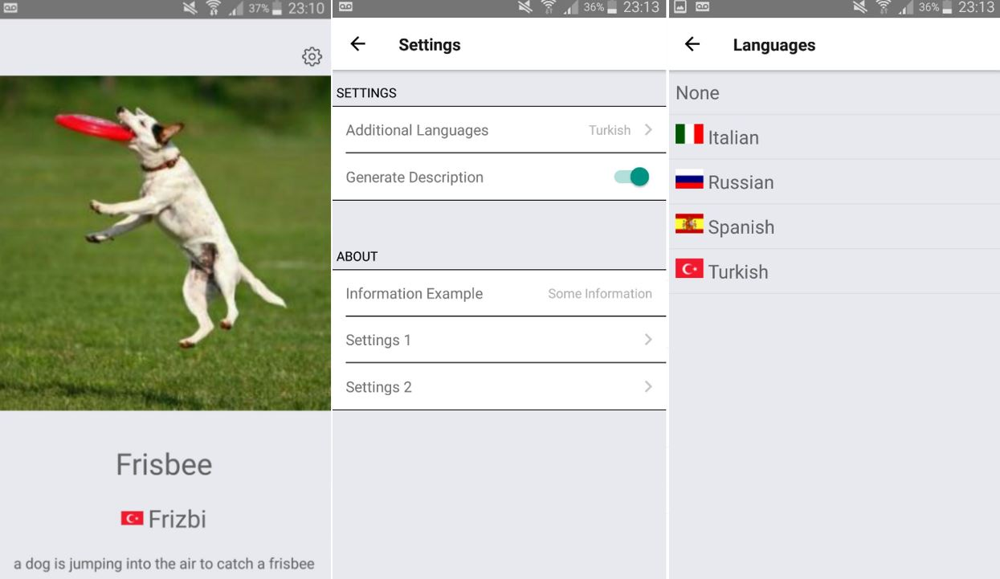
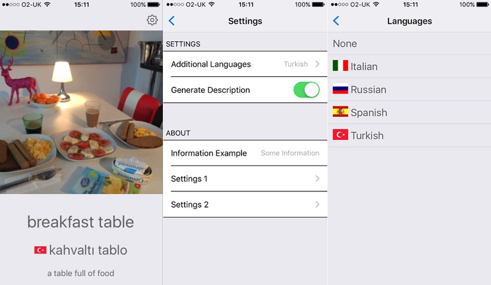

# Deep Learning (ResNet) on Mobile App

[Web-App Demo](http://ilkarmanwhatsthis.azurewebsites.net/)

This project goes through an end-to-end example of using Azure services to:

1. Integrate your own deep-learning project with a mobile app
2. Integrate existing Azure APIs with a mobile app

## Update (23/03/2017):

Soon Azure Container Services will accept a CNTK docker image and deploy that to a kubernetes cluster!

[See Here](00-Resnet/ACS Deploy.ipynb) for more info

### Tutorials

[Tutorial: Installing CNTK, MXNet, Tensorflow and Keras on Azure Web-App](02-WebApp/AzureWebApp.md)

[Tutorial: CNTK Demo on Azure Web-App](https://github.com/ilkarman/Azure-WebApp-w-CNTK/)

[Check out step-by-step YouTube](https://youtu.be/nMZ8lTo-96k)

[Tutorial: Setting up Flask, Gunicorn, Supervisor on VM](01-VM/FlaskVM.md)

### Android

[Latest Build](build/app-release.apk)

### iPhone

### Web-View

### Infrastructure

### Further Examples

